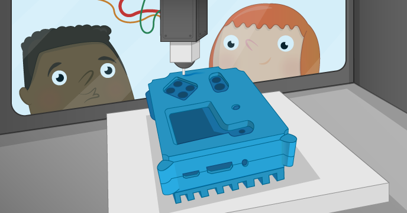

# 3D Printed Astro Pi Flight Case

The Astro Pi flight case is one of the most desired cases in the history of the Raspberry Pi. With this resource you will learn how to 3D print your own case and install the Astro Pi hardware inside it. You'll then have your very own Astro Pi flight unit identical in almost every way to the ones on the International Space Station right now.

If you're participating in an Astro Pi competition this is a great way to prototype and ergonomically test your code in the same way as it would be used by the crew of the ISS.

## Checklist

If you're planning to build a full Astro Pi flight unit, check that you have all the parts required before you start:

- 1 x Raspberry Pi (B+ or 2B)
- 1 x Camera Module (normal or Pi NoIR version)
- 1 x Sense HAT
- 1 x 2x20 pin PCB header- 15 mm long pins, 2.54 mm pitch spacing
- 4 x M2 cross head screw - 4 mm
- 4 x M2.5 male to female stand off - 11 mm†
- 4 x M2.5 male to female stand off - 8 mm†
- 4 x M2.5 nut or washer - 1.6 mm depth†
- 4 x M2.5 cross head screw - 6 mm
- 4 x M4 30 mm bolt
- 4 x M4 hex nut

† = These are used to hold the Sense HAT at the correct height, you could achieve this in other ways if you wish. For example with single 20.6 mm stand offs.

If you want to buy the exact buttons used in the Astro Pi flight unit the details are below, at about £9 each they're expensive because they're designed to survive an enormous number of clicks before wearing out (necessary for a 7 year space mission). So you might want to consider looking for a cheaper one that would also fit. The button needs a threaded bushing of 10 mm diameter to fit the holes in the lid.

- Manufacturer: APEM
- Manufacturer Part No: 104350003
- [Farnell](http://uk.farnell.com/apem/104350003/switch-spdt-3a-24vdc-tht/dp/1086639)
- [RS](http://uk.rs-online.com/web/p/push-button-switches/2369547/)

## Get access to a 3D printer

First and foremost you'll need access to a 3D printer to do this. Many schools now have their own but if your school doesn't then you may be able to find one at your local [hackspace](http://www.hackspace.org.uk/wiki/Main_Page). You can also find local 3D printing services through the [3D Hubs](https://www.3dhubs.com/) website.

## Get the 3D files

The 3D files are in [STL](https://en.wikipedia.org/wiki/STL_%28file_format%29) format which is widely used in 3D printing all over the world. The software for your 3D printer will have no problem loading them.

- [Part 1](https://github.com/raspberrypilearning/3d-printed-astro-pi-flight-case/raw/master/STL/Astro_Pi_Enclosure_3D_PRINT_SECTION_1%20V1.STL) (heat sink)
- [Part 2](https://github.com/raspberrypilearning/3d-printed-astro-pi-flight-case/raw/master/STL/Astro_Pi_Enclosure_3D_PRINT_SECTION_2%20V1.STL) (base)
- [Part 3](https://github.com/raspberrypilearning/3d-printed-astro-pi-flight-case/raw/master/STL/Astro_Pi_Enclosure_3D_PRINT_SECTION_3%20V1.STL) (middle)
- [Part 4](https://github.com/raspberrypilearning/3d-printed-astro-pi-flight-case/raw/master/STL/Astro_Pi_Enclosure_3D_PRINT_SECTION_4%20V1.STL) (lid)

The 3D files do not exactly match those used to make the aluminium flight cases on the space station. They have been modified to make them 3D printer compatible so that most people who attempt this will achieve success without difficulty.

Most notably the case has been sliced into four parts. This has been done to minimise the amount of rafting and scaffolding that needs to be printed along with the model and also reduces the time you spend cleaning up the final prints.

## Safety first

**It is important that you observe the correct safety procedures specified in the safety data sheet for your specific 3D printer.**

Potential hazards include:

- Hot surfaces and thermoplastics (print head block and lamp)
- Ultraviolet radiation (lamp)
- High voltage (lamp connector, electric outlet)
- Moving parts (printing assembly)

## Print each part

Because there are so many different types of 3D printer we cannot possibly provide instructions for them all, so we can only provide rough guidance here and you'll need to figure out the rest on your own.

To get a nice finish we recommend you print on a high detail setting, usually this is a number specified in [microns](https://en.wikipedia.org/wiki/Micrometre) in the 3D printer software. The lower this number is the more precise the model will come out. Please also be aware that precise prints take longer and, for these models, each piece can take up to **four** hours to complete. Make sure you have enough filament.

The STL files should have the models like this by default but please make sure you print in the orientations shown below in order to minimise scaffolding and rafting. 

### Heat Sink

### Base

### Middle

### Lid

## Remove the scaffolding

In order to keep the model structurally sound while printing your 3D printer will create what's called scaffolding and rafting to prevent the hot thermoplastics from bending or sagging. Leave the print to cool right down to room temperature before you touch it.

### Heat Sink

You should be able to remove the scaffolding on the heatsink using just yout hands, this part may bend slightly so don't be too rough while doing this.

You may choose to not print this part because it's not essential to the rest of the case and because it's made of plastic it *will not* work as a heatsink. We've included it anyway so that you can achieve the iconic look and feel of the Astro Pi flight case though.

### Base

The base scaffolding should come away easily, as with the heatsink, however you'll also need to remove some material that was used to support the corner bolt enclosures and around the aperture for the Micro SD card. A small pair of pliers is ideal for this.

### Middle

Again the scaffolding should come away easily and there will be some material around the corner bolt enclosures that you'll need to remove.

### Lid

The bottom layer of scaffolding on the lid should come away easily as before.

However there are a few sunken holes on the underside that must also be cleared of material. These are there to prevent the lid from impacting the Raspberry Pi hardware when installed into the case. You'll need a scalpel or craft knife to dig into it.

Once you've managed to lift some of it use a pair of small pliers to remove the rest of the material. The areas marked with a red star below also need the same treatment.

When you're done it should look like this:

## Do a fit check

Before proceeding put all the pieces together to check that they fit together correctly. The lipped edge between the base and middle pieces is of most concern to you here. The heat sink and lid just need to line up.

